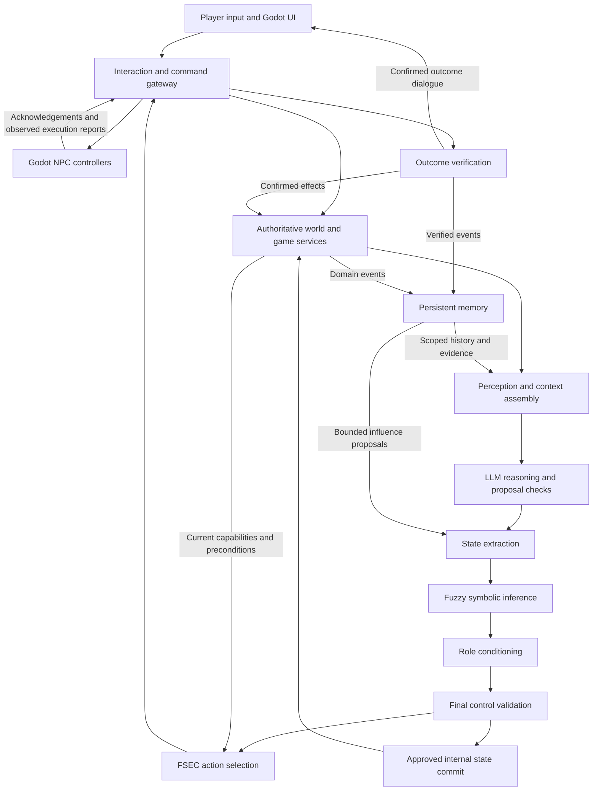

# High Level Design

## 1 Purpose and design status

This document describes the target architecture for the NPC closed-loop behaviour system defined in [proposal.md](proposal.md). It identifies component responsibilities, relationships, information flow, authority boundaries and operational concerns. It does not define implementation tasks, delivery phases, detailed APIs or database schemas.

The goal is believable, evolving NPC behaviour whose dialogue and actions remain consistent with the game world. The LLM proposes intent and expression; deterministic control policies constrain behaviour; authoritative game services confirm effects. Verified outcomes update the world and memory, informing subsequent decisions.

**Status: high-level design with project-owner clarifications incorporated.** Section 10 records the confirmed control ordering, local deployment, village scope and state-commit timing. Numeric operating targets and retention periods are intentionally left open for evaluation of the local demo.

This is a target design, not a claim that all components already exist. The proposal identifies partial context, dialogue validation and state handling; selective semantic memory and persistent gameplay already provide a foundation. Full perception, fuzzy inference, relationship evolution, FSEC and executable NPC controllers are target capabilities.

An existing product decision remains in force: ordinary launches resume saved gameplay. Explicit **Restart Game** clears the current game's quests, inventories, NPC state, chats and memories and restores initial state. Restart is not an automatic consequence of connecting or opening another window.

## 2 Architecture overview

The system separates five responsibilities:

1. **World authority** maintains identities, positions accepted by the authority boundary, inventories, quests, relationships and game events.
2. **Perception and reasoning** construct what a particular NPC can know and propose a grounded response.
3. **Behavioural control** turns a proposal into bounded, coherent, role-permitted behaviour.
4. **Execution and outcome verification** deliver commands, run controllers and distinguish attempted actions from confirmed effects.
5. **Memory and feedback** retain relevant history and supply bounded influences to future decisions.

A modular Python backend is the recommended logical host for domain authority, perception, reasoning orchestration, control and persistence. Godot hosts player interaction and controller presentation. Model inference is behind a provider boundary. The target is a local single-player application. Godot runs movement and presentation; the backend accepts controller reports only after checking the active command, permitted movement and world constraints. A separately hosted authoritative simulation server is outside this scope.

These are logical components, not a requirement to deploy a microservice for each layer. Keeping closely related control and game-state operations within one backend reduces coordination overhead and supports consistent transactions. Independent model inference and a replaceable engine adapter preserve useful separation without distributing every decision stage.

The confirmed order is State Extraction → Fuzzy-Symbolic Inference → Role Conditioning → final Control Validation → FSEC. Final validation examines the conditioned result so role modifiers cannot undo semantic or temporal constraints. Model output, memory and controller reports do not bypass authoritative game services.

## 3 Major components and relationships

| Component | Responsibility | Principal relationships and boundary |
| --- | --- | --- |
| Player interface and interaction gateway | Accept player speech and requested actions, identify their game context, deliver commands and expose saved state. | Passes requests to world/perception services. A request expresses intent; it is not proof of ownership, visibility or success. |
| Authoritative world and game services | Own world entities, inventories, quest transitions, approved NPC state, relationships and domain events. | Supplies perception and execution preconditions; commits permitted effects; publishes verified events to memory. Factions, economy, combat and generalized quests are extension interfaces; the required gameplay domain is the village and bow quest. |
| Perception | Collect NPC-accessible observations, internal state, relevant game facts and history; normalize, filter and rank them into an immutable snapshot. | Reads world services and scoped memory. Preserves the distinction between observation, interpretation, claim and remembered information. Does not execute or persist state changes. |
| LLM reasoning | Combine the snapshot, stable personality/role profile and conflict priorities into a decision proposal. | Receives only bounded context. Proposal checks enforce structure and grounding references before state extraction. Cannot query unrestricted game data or mutate it. |
| State extraction | Convert permitted relative changes and behavioural signals into a normalized candidate state. | Combines current approved state with decision or memory-influence proposals. Remains deterministic and side-effect free; candidate state is not committed state. |
| Fuzzy-symbolic inference | Derive interpretable behaviour tendencies from overlapping state memberships and weighted rules. | Receives normalized state; supplies tendencies and rule contributions to control. Soft preferences never authorize actions. |
| Role conditioning | Enforce a versioned role's permissions, duties, targets, absolute state limits and expression modifiers. | Conditions candidate state and tendencies using authoritative profiles. Unknown or unsupported permissions cannot become executable privileges. |
| Control validation | Enforce provenance, world constraints, cross-variable consistency and temporal continuity; approve, narrow, fall back or reject. | Uses the current decision chain and prior approved behaviour. Runs after Role Conditioning and checks its conditioned result against world, semantic and temporal policies before FSEC. |
| FSEC | Select an eligible action using deterministic utility scoring and map behaviour to bounded engine-neutral parameters. | Receives controlled behaviour and fresh capability/precondition information. Produces a command, not a completed game effect. |
| NPC controller and outcome verification | Execute movement, facing, animation, interaction attempts and timed dialogue; track command progress and verify reports. | Godot reports execution observations. The authority boundary verifies them and the relevant game service confirms any world mutation. |
| Persistent memory | Classify and retain relevant events/claims, maintain provenance and lifecycle, retrieve scoped context, and propose bounded long-term influence. | Ingests verified outcomes and approved conversations. Returns evidence to perception and influence proposals to control; never directly changes world facts. |
| Policy and trace support | Provide versioned profiles, rules, constraints and mappings; connect observations, decisions, commands and outcomes. | Shared across layers. Configuration validation and access controls keep tuning from becoming an authority bypass. |

Stable personality and role definitions are distinct from changing emotions, relationships, goals and controller state. This allows an NPC to adapt to experience without silently changing its identity or permissions.

## 4 Data ownership and persistence

| Information category | Authority and intended use |
| --- | --- |
| World and game state | Authoritative game services own current facts and valid transitions. Inventory and quest state are not reconstructed from generated dialogue or semantic similarity. |
| Approved NPC and relationship state | Stored by a state-commit boundary after required controls approve the change. Approved internal changes commit at final decision approval; changes dependent on an interaction or command outcome wait for verified effects. Failed execution does not erase a valid internal reaction, but it cannot count as a successful transfer or fulfilled commitment. |
| Perception snapshots and decision records | Immutable, revision-linked evidence for a particular decision. Later world changes can invalidate their applicability without rewriting their history. |
| Command lifecycle and verified outcomes | Durable records distinguish issuance, acceptance, running, completion, failure, cancellation and expiry. An acknowledgement alone does not establish a successful world effect. |
| Conversations and durable memories | Conversation history preserves exchanges; importance rules select long-term memory. Facts, claims, inferences, corrections and rumors retain distinct provenance and knowledge scope. |
| Embeddings and vector indexes | Derived retrieval data, associated with a model/version. The database remains authoritative; indexes can be rebuilt and cannot create or confirm facts. |
| Policy versions and operational traces | Identify the profiles, constraints and mappings used for each decision, subject to controlled access and retention. |

Memory records need recipient/knowledge scope, participants, event type, relevant quest or entity, source time, confidence and lifecycle status. Superseded or retracted information can remain historical evidence while being excluded from current factual context. Exact duplicate events are consolidated using source identity; similar wording alone is insufficient to merge facts or resolve contradictions.

The existing semantic path remains the baseline: real embeddings, NPC/metadata filtering, a bounded FAISS candidate set, then similarity/importance/recency reranking. The target adds context-aware retrieval, provenance-safe correction, category budgets and priority retrieval for relevant authoritative events. During an embedding outage, a declared metadata/lexical/recency path may return eligible records; fabricated vectors are never a substitute.

Persistence covers normal disconnects and process restarts. Explicit game restart resets the playable timeline and invalidates prior commands and retrieval context so late responses cannot restore deleted progress. Operational diagnostics, if retained outside the playable timeline, must not feed the new NPC memory context; their retention policy remains to be defined.

## 5 Data flow and control flow

### 5.1 A normal decision

1. A player interaction or observable world event enters the gateway. Identity, ownership, replay and interaction eligibility are checked against the game's authority boundary.
2. Perception reads a consistent, revision-linked view of the NPC's accessible world and internal state. It retrieves relevant memory using the current interaction, participants, location and goals. It then produces the immutable snapshot; memory retrieval must not recursively require an already completed snapshot.
3. The reasoning component combines the snapshot with a stable profile and conflict priorities. The LLM proposes intent, behaviour signals, dialogue and bounded candidate changes. Structural and grounding checks reject unsupported references or invalid vocabulary.
4. State extraction constructs candidate absolute state without persistence. Fuzzy inference derives bounded tendencies with explainable contributions.
5. Role Conditioning applies role policy, then final Control Validation enforces hard constraints and continuity on the conditioned result. Rejection stops command creation. A declared repair or fallback retains the original proposal and its reason. At final approval, the state-commit boundary persists approved internal changes once, linked to the decision revision; outcome-dependent changes remain pending.
6. FSEC evaluates only eligible actions, using current capabilities and preconditions. It selects a command and bounds its movement, interaction, animation and expression parameters. A stale or unavailable target requires a safe alternative or a new decision.
7. The command is delivered to the appropriate controller. The controller reports its lifecycle and interaction attempts. Relevant game services validate and commit effects, including any outcome-dependent state changes, before those effects are announced as completed.
8. Verified outcomes and approved conversation events enter memory ingestion. Stored evidence and bounded, source-linked influences inform a later decision. Replaying an event cannot apply its memory or relationship influence twice.

Only changed or newly observed information requires a new decision; the LLM is not part of the frame-by-frame movement loop. Controllers maintain bounded execution independently. Urgent safety events can interrupt ordinary behaviour through deterministic policy without waiting for a model response.

### 5.2 Dialogue and action synchronization

**Expression** describes current permitted tone or internal expression and can accompany an accepted command. **Commitment** describes an intended action after acceptance, with an interruption/failure update if necessary. **Outcome dialogue** describes success only after the matching authoritative outcome exists.

For example, the Craftsman can say it intends to help before an interaction finishes. It can say that wood was received only after an ownership-checked transfer commits. A proposed bow reward, movement animation or client acknowledgement is not sufficient evidence that the player owns a bow.

### 5.3 Failure, interruption and recovery

A command has one logical lifecycle with a terminal outcome. Duplicate delivery is tolerated through command identity and revision checks. Expired or superseded commands cannot apply effects, and reconnect resumes or reconciles durable status rather than replaying success blindly.

No database transaction remains open for the entire LLM call or a multi-second movement. Revisions and preconditions are checked again at the commit boundary. World effects and their durable outcome/delivery records are committed together so a crash cannot silently lose the event needed to reconcile controller state and memory.

On model failure, the system selects only a declared safe response. On navigation failure, it records failure and suppresses success dialogue. On database failure, it does not announce a committed effect. Urgent authoritative danger can override normal smoothing, with an explicit reason recorded in the trace.

## 6 External dependencies and deployment boundaries

| Dependency | Architectural purpose | Design constraint or tradeoff |
| --- | --- | --- |
| Godot and GDScript | Player UI, physics/navigation, animation and NPC controller presentation. | Controller capabilities constrain selectable actions. Godot simulates locally; the backend verifies reports. Multiplayer anti-cheat guarantees are outside this scope. |
| Python, FastAPI and typed validation | Backend orchestration, interaction boundary and cross-layer contracts. | Modules remain separable logically without requiring independent services. |
| SQLAlchemy and PostgreSQL | Persistent game state, event/command records, memory and transactional coordination. | Relational persistence favours consistent effects and recovery. SQLite can support lightweight development checks but is not equivalent evidence for PostgreSQL concurrency. |
| Ollama or a compatible LLM provider | Bounded decision-proposal generation through a provider adapter. | Local inference reduces external data exposure but consumes local compute; a remote provider changes latency, privacy and availability requirements. |
| Semantic embedding provider | Meaning-based memory vectors; the existing baseline uses local Nomic embeddings. | Model/preprocessing versions must match indexed data. Outages degrade retrieval rather than corrupting memory. |
| FAISS and numeric runtime | Efficient bounded semantic candidate search. | Indexes are derived, approximate and rebuildable. Candidate misses require retrieval evaluation and authoritative-priority paths where appropriate. |
| HTTP command and event transport | Player requests, initial polling delivery, acknowledgements and recovery. | Polling is a simple baseline; lower-latency push remains an interchangeable transport if requirements justify it. Durable command semantics must not depend on a connection remaining open. |

No additional message broker, cloud platform or microservice topology is required by this high-level design. A durable delivery boundary is required, but its physical mechanism is not prescribed here.

## 7 Key decisions and tradeoffs

- **Proposals are separate from authority.** LLM creativity improves intent and dialogue, but every state and game effect crosses deterministic approval boundaries. This adds contracts and trace data in exchange for controlled gameplay.
- **Pure transformation precedes commit.** Extraction, fuzzy inference and conditioning produce inspectable candidates. Side effects are isolated, making rejection and replay easier to reason about. Final approval commits internal changes; verified outcomes govern effect-dependent changes. Decision and outcome identities prevent double application.
- **Hard constraints precede utility competition.** Safety, world validity and role denials remove options; high utility cannot compensate for an illegal action. This deliberately limits generative freedom.
- **Fuzzy tendencies shape behaviour rather than replace game rules.** Overlapping memberships support gradual expression and explainable combinations. Designers must still tune and evaluate rule interactions; fuzzy inference alone does not demonstrate believable behaviour.
- **Continuity is based on approved history.** Rate limits, smoothing and hysteresis reduce oscillation, while urgent evidence can justify immediate interruption. Responsiveness and stability require measured tuning.
- **Knowledge is scoped and sourced.** NPCs reason from permitted observations and historical evidence, preventing global database access from becoming omniscience. Propagation and visibility rules add domain complexity but make memory meaningful.
- **Memory influences future decisions through proposals.** A verified helpful event can support a bounded relationship change. A claim cannot bypass control or overwrite inventory. Influence must be idempotent to avoid repeated retrieval inflating trust.
- **Commands and outcomes are different records.** Delivery retries are acceptable; duplicated effects are not. Durable lifecycle tracking and verified outcomes improve recovery at the cost of coordination and storage.
- **Deterministic control supports replay.** Profiles, rules, mappings and approved inputs are versioned. Model generation itself need not reproduce identical text; replay uses the recorded proposal and verifies downstream decisions. Any intentional action randomness requires an explicit logged seed.
- **Evolution is not guaranteed uniqueness.** Different histories and states may lead to different permitted behaviours. Neither varied wording nor the architecture alone proves that every player receives a unique experience; that needs behavioural evaluation.

## 8 Security, reliability and observability

### Security

The client, model output and historical text are separate trust boundaries. Player input cannot assert authoritative location, visibility, ownership or completion. Controller reports require validation against a permitted command and current world state. The local deployment should bind backend and model services to loopback and restrict accepted origins. It assumes a trusted local machine, not resistance to a malicious local owner. Internet exposure, independent player accounts and multiplayer anti-cheat are outside scope; a future networked deployment would require authenticated identities, world-level authorization and a trusted simulation boundary.

Snapshots and memories are bounded data with provenance, not instructions. Prompt formatting and instruction neutralization reduce exposure but do not guarantee resistance to prompt injection. Schema checks, reference validation, role permissions and restricted execution remain the enforcement boundary. Policies and profiles are controlled design assets; modifying them must not permit arbitrary engine commands or unlisted privileges.

Secrets remain outside prompts, client payloads and logs. Traces expose only the fields needed for diagnosis. Conversation and player-related memory retention must balance audit needs with data minimization. Restart applies to the single local save, requires explicit confirmation and must invalidate outstanding work from the previous playable timeline.

### Reliability

Versioned handoffs connect each command to the exact snapshot, state and policies that produced it. Revision checks reject stale work; bounded retries and expiry prevent indefinite execution. Input deduplication and idempotent commits prevent repeated rewards, interactions and memory influence.

Persistence distinguishes approved state, running commands, terminal outcomes and derived indexes. Reconnect reconciles those categories. Memory ingestion and vector creation can recover after inference outages without blocking the recording of authoritative outcomes. Corrections supersede historical claims rather than silently rewriting them.

Under load, limit per-NPC concurrent decisions, snapshot size, model budgets and command queue depth. Avoid overlapping decisions that repeatedly invalidate one another. By project-owner decision, numeric latency, throughput, availability and retention targets remain open for evaluation of the local demo. No quantitative capacity or service-level claim is made.

### Observability

A correlated trace follows interaction/event → snapshot → decision → extracted state → fuzzy result → control/role result → command → verified outcome → memory. It records policy/model versions, source references, relevant rule contributions, rejected candidates, repairs, lifecycle transitions and retrieval reasons. Concise reasoning summaries are diagnostic model output, not proof that a decision is correct.

Operational signals include decision latency by stage, model failures, validation rejection/fallback rates, stale decisions, command success/failure/expiry, duplicate suppression, outcome-dialogue violations, memory/index backlog and retrieval quality. Behavioural evaluation examines continuity, role consistency and meaningful state-dependent variation. Debug traces may be detailed; routine logs should use IDs and reasons rather than unrestricted conversation or vector dumps.

## 9 Risks and mitigations

| Risk | Mitigation and remaining limit |
| --- | --- |
| Layers use conflicting control orders | Use the confirmed Role Conditioning → final Control Validation → FSEC sequence and consistent source-linked contracts. FSEC must preserve the validated constraints. |
| The deployment lacks a trustworthy spatial authority | Use backend verification within the trusted local single-player boundary. Plausibility checks on reports are not equivalent to authoritative server physics; networked anti-cheat remains out of scope. |
| LLM claims or injected memories appear as game facts | Preserve epistemic status and provenance; validate references; keep effects behind authoritative services. Natural-language filtering alone remains insufficient. |
| Stale snapshots, concurrent decisions or replayed commands duplicate effects | Revisions, per-NPC ordering, expiry, idempotency and atomic outcome records; reconcile before retry. |
| Dialogue reports success before execution completes | Separate expression, commitment and outcome timing; require the corresponding confirmed event for completion claims. |
| Behaviour oscillates or role modifiers undo validation | Approved-history smoothing and switching thresholds; emergency rules; validate after role conditioning and preserve final invariants at the execution boundary. |
| Memory repeatedly reinforces an event or preserves a superseded claim | Source-linked idempotent influence, lifecycle filtering, correction links and bounded changes; ambiguous claims remain uncertain. |
| Semantic search misses a critical fact or merges opposites | Metadata scope, authoritative-priority retrieval and retrieval evaluation; do not infer truth or merge negation from embedding similarity. |
| Inference latency or index rebuild cost makes interaction sluggish | Bounded decisions/candidates, controller autonomy, safe fallbacks and measured cache/index policies. Numeric performance targets remain unspecified. |
| Expanded simulation overwhelms the village demonstration | Keep economy, combat, factions and generalized quests as extension interfaces. Required scope remains village NPC behaviour and the bow quest. |
| Restart or reconnect revives old-world state | Invalidate the old playable timeline, commands and retrieval context; reconcile durable records before presenting state. |
| Logs and memory grow without bound | Separate historical retention from retrieval decay; archive or remove according to agreed policy, preserving only required provenance. Exact retention periods remain open. |

## 10 Confirmed decisions and deferred targets

The project owner resolved the proposal’s ambiguities as follows:

| Topic | Confirmed decision | Architectural consequence |
| --- | --- | --- |
| Control ordering | Role Conditioning → final Control Validation → FSEC | Validation checks the role-adjusted candidate. Early proposal schema/grounding checks remain a separate gate. |
| Deployment | Local single-player Godot and backend, with verified controller reports | One local playable save; no multiplayer identity or trusted remote simulation claim. |
| Required gameplay scope | Village NPC behaviour and the bow quest | Factions, economy, combat and generalized quests are extension interfaces, not required domains. |
| State-commit timing | Internal changes at final decision approval; outcome-dependent changes after verification | Track approval and execution separately; a failed action cannot produce its proposed world or relationship reward. |
| Persistence and restart | Resume saved gameplay on launch; explicit Restart Game resets gameplay and memory | Preserve continuity across ordinary sessions and invalidate previous-timeline work on reset. |

**Confirmed deferral:** leave numeric NPC-count, response-time and chat/debug-trace retention targets open and evaluate the local demo first. This design therefore makes no numerical performance promise and specifies no automatic deletion period. Resetting playable memory does not itself define operational audit retention. These are deliberate evaluation decisions, not assumed service-level guarantees.
